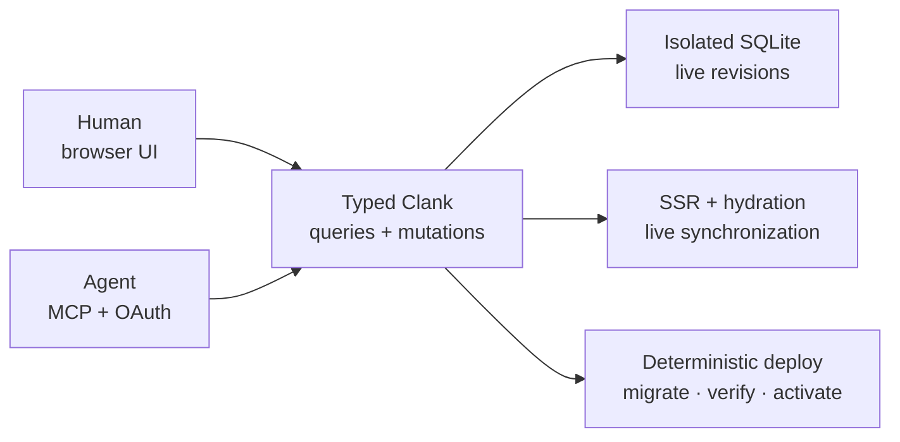

<div align="center">
  
  <h1>Clank</h1>
  <p><strong>The AI-first full-stack TypeScript framework.</strong></p>
  <p>
    Build one secure, reactive application for people and agents.<br>
    Ship its UI, API, database, auth, live sync, and MCP server together.
  </p>
  <p><a href="https://www.npmjs.com/package/@clank.run/framework"><code>@clank.run/framework</code></a> · <strong>Zero dependencies</strong> · Node.js 22.16+ · <a href="./LICENSE">MIT</a></p>
  <p>
    <a href="https://docs.clank.run"><strong>Documentation</strong></a>
    ·
    <a href="https://clank.run"><strong>Deploy</strong></a>
    ·
    <a href="./examples"><strong>Examples</strong></a>
    ·
    <a href="./CONTRIBUTING.md"><strong>Contribute</strong></a>
  </p>
</div>

---

Clank is a dependency-free framework and open-source deployment platform for building full-stack
TypeScript applications. It combines fine-grained reactivity, compiler-powered TSX, server
rendering with node-preserving hydration, built-in authentication, user-owned SQLite data, live
queries, automatic MCP tools, immutable migrations, and health-gated deployment.

“AI-first” does not mean adding a chat box to every page. It means every application has two
first-class interfaces backed by the same typed contracts:

| For people | For agents |
| --- | --- |
| Accessible HTML, responsive state, forms, navigation, Tailwind CSS, SSR, live updates, and inspectable workflow progress | Authenticated MCP tools, JSON Schema, OAuth + PKCE, explicit side-effect metadata, semantic UI inspection, and workflow graph manifests |

## From zero to deployed

```sh
npm install --global @clank.run/framework

clank login
clank templates
clank create my-app
cd my-app
npm install
npm run dev
```

When the app is ready:

```sh
clank doctor
clank deploy
```

`clank login` connects to [clank.run](https://clank.run) by default. Run `clank` without arguments
for the interactive launcher, or give the same commands directly to a coding agent or CI job.
Agents can inspect the exact starter capabilities with `clank templates --json` and receive a
checksummed file manifest plus next-command map from `clank create my-app --json`.
For a product built from a conversation, `clank compose` accepts an agent-prepared blueprint or a
deliberately configured agent executable, freezes a checksummed file review, and writes nothing
until a person or orchestrator approves that exact digest. [Read the composition contract →](https://docs.clank.run/docs/conversational-build)
`npm run dev` is a complete local supervisor: it rebuilds TypeScript and Tailwind, starts only
healthy replacements, keeps the last good process after errors, and reloads connected browsers.
Agents can use `clank dev --json` for stable newline-delimited lifecycle events.

The generated app is already a working product—not an empty component. It includes:

- registration, login, logout, secure sessions, and CSRF protection;
- private per-user SQLite data with typed queries and mutations;
- bounded document revision history with conflict-safe compensating restores;
- durable typed job workflows with parallel branches, retries, cancellation, and visible graphs;
- server rendering and node-preserving hydration;
- live updates across tabs and browsers;
- Tailwind-compatible styling;
- an authenticated, app-specific MCP server;
- typed UI action references with generated UI↔MCP parity checks;
- deterministic synthetic fixtures and an application-owned contract test;
- an immutable initial migration and deterministic deployment contract; and
- focused `README.md` and `AGENTS.md` instructions.

The first deploy creates and links the hosted project automatically. Every later deploy builds a
checksummed artifact, backs up data, applies ordered migrations, health-checks the candidate, and
keeps the prior release available if activation fails.

For provider-isolated projects, one command adds secretless GitHub pull-request previews:

```sh
clank preview github configure owner/repository
```

It binds GitHub's immutable repository identity and writes pinned deploy/cleanup workflows. Each
job exchanges GitHub Actions OIDC for a one-time, 15-minute token that can touch exactly one
`pull-N` preview—never production or a sibling preview. No Clank token is stored in GitHub.
[Read the pull-request preview contract →](https://docs.clank.run/docs/preview-environments#github-pull-request-previews)

> Prefer a smaller starting point? Use `clank create my-app --template=minimal`.

## One application, one contract



Define trusted server functions once. Clank infers their TypeScript clients, validates their
inputs and outputs, updates subscribed browser queries after commits, and publishes the eligible
functions as MCP tools. The MCP contract revision changes whenever a tool name, schema,
description, scope, or annotation changes, so clients can refresh without serving a stale action
model.

Each deployed app owns its authentication boundary, data, OAuth issuer, and MCP endpoint:

```text
https://your-app.apps.clank.run/__clank/mcp
```

[Learn how per-app MCP works →](https://docs.clank.run/docs/per-app-mcp)

## Reactive code stays small

```tsx
/* @clankImportSource @clank.run/framework */
import { computed, signal } from "@clank.run/framework";

const count = signal(0);
const label = computed(() => `Count: ${count.value}`);

export function Counter() {
  return (
    <button
      class="rounded-full bg-slate-950 px-4 py-2 text-white"
      onClick={() => count.value++}
      agentId="increment"
      agentLabel="Increase count"
    >
      {label.value}
    </button>
  );
}
```

There is no virtual DOM. Components establish bindings once, and signals update only the text,
attribute, or keyed region that depends on them. The included compiler handles TypeScript and TSX;
applications do not need a separate runtime compiler or bundler.

## A complete headless UI, already included

Clank includes a zero-dependency, Clank-native headless library with all 37 Base UI 1.6 families
plus native Bottom Sheet and Pagination controllers: 39 documented families in total. It is not a
React compatibility layer; factories return reactive controllers and DOM props that work directly
with Clank TSX.

```tsx
import { Portal, Show, onMount } from "@clank.run/framework/dom";
import { createDialog } from "@clank.run/framework/ui/dialog";

export function NewProjectDialog() {
  const dialog = createDialog({ id: "new-project" });
  onMount(() => dialog.dispose);

  return (
    <>
      <button {...dialog.trigger()}>New project</button>
      <Show when={dialog.isMounted}>
        <Portal>
          <div {...dialog.portal()}>
            <div {...dialog.backdrop()} class="fixed inset-0 bg-black/50 data-[closed]:hidden" />
            <section {...dialog.dialog()} class="fixed inset-4 m-auto max-w-lg rounded-2xl bg-white p-6">
              <h2 {...dialog.title()}>Create a project</h2>
              <button {...dialog.close()}>Cancel</button>
            </section>
          </div>
        </Portal>
      </Show>
    </>
  );
}
```

The same primitives cover accessible relationships, keyboard and focus behavior, native form
projection, RTL-aware navigation, SSR/hydration, portals, presence, collision-aware positioning,
Tailwind data hooks, and frozen agent-readable manifests. Import from the package root, `/ui`, a
group path, or any `/ui/<family>` path. Ten immutable, typed theme presets are available from
`@clank.run/framework/ui/theme`, and every family has a real interactive specimen at
[design.clank.run](https://design.clank.run). [Read the complete headless UI contract →](https://docs.clank.run/docs/ui)

Field controllers compose directly with Select, Combobox, Autocomplete, Checkbox, Switch, Input,
Number Field, OTP Field, and Slider. Popup controllers expose explicit `isMounted()`/`portal()`
presence, native controls preserve browser submission and validation, and structured cancellation
keeps multi-part value changes atomic. These contracts give humans and agents the same small,
inspectable surface instead of hiding behavior in generated component code.

## What is included

| Build the interface | Own the backend | Ship the product |
| --- | --- | --- |
| Signals, computed values, effects, stores, resources, typed TSX, keyed lists, forms, dialogs, tabs, routing, Tailwind CSS, SSR, and hydration | Runtime schemas, inferred API clients, auth, roles, owned documents, SQLite indexes, atomic mutations, live queries, first-party durable objects, files, email, jobs, workflow graphs, and webhooks | Interactive CLI, browser-approved login, project provisioning, durable invitation email, secrets, migrations, backups, job/cron/workflow operations, health gates, rolling activation, metrics, logs, custom domains, and rollback |

<details>
<summary><strong>Explore the complete framework feature map</strong></summary>

| Layer | Features |
| --- | --- |
| Reactivity | Signals, lazy computed values, effects with cleanup, batching, rollback transactions, untracked reads, owned roots, deep proxy stores, snapshots, async resources, stream reduction |
| UI | Typed compiler-powered TSX, automatic reactive expressions and props, keyed lists, stable text nodes, lifecycle/context, a 39-family dependency-free headless catalog, native form parts, responsive bottom sheets, overlays, portals, RTL, SSR/hydration, agent manifests, directives, `Show`, `For`, `Switch`, and lazy components |
| Forms | Schema validation, typed fields, accessible control/error props, touched/dirty state, cross-field rules, cancellation, server errors, invalid-focus behavior, reset, agent-readable manifests |
| AI | Approval-bound conversational application composition, signed exact-version blueprint registries, web-focused runtime schemas, automatic MCP Streamable HTTP actions, OAuth + PKCE agent authorization, per-user agent access inboxes and revocable scoped grants, JSON Schema output, side-effect policy, action runners, semantic views, native-label-aware inspect/activate/input surface, and isolated real-browser journeys with secret-value redaction |
| UI↔MCP parity | Typed `agentAction` function references, bounded SSR/DOM inspection, manifest and revision verification, stable-control enforcement, structured mismatch reports |
| Generated verification | Blueprint-derived synthetic fixture users and related records, real backend seeding, ownership isolation, exact agent/UI manifest parity, per-route SSR contracts, and a selector-free mobile Chrome smoke journey |
| Routing | Parameters, optional segments, wildcards, repeated query values, async loaders, aborts, guards, redirects, titles, links, history navigation |
| Full stack | Inferred schemas, documents, arguments, and results; branded IDs; query and mutation functions; zero-codegen typed API references |
| Auth | Email/password sessions, scrypt hashing, secure cookies, CSRF, roles, revocation, default auth UI, SSR boot state |
| Data | Node's built-in SQLite, JSON documents, declared expression indexes, owned tables, atomic mutations, immutable document history, compensating restores, persisted live revisions, dependency-tracked query cache, and privacy-first typed product analytics |
| Durable objects | Stable typed namespace/ID stubs, per-ID local FIFO lanes, renewable cross-process leases, stale-runtime fencing, transactional state, mutation idempotency, schema migrations, alarms with retry, live revision subscriptions, aggregate diagnostics, and opt-in exact-authorized MCP tools |
| Live sync | Auth-partitioned Fetch RPC and cache, EventSource streams, session revocation, automatic invalidation, SSR seeding, multi-tab synchronization, and bounded presence/cursor/signal rooms |
| SSR | Async string rendering, full-document templates, safe state serialization, CSP nonces, context and keyed lists, marker-based DOM-preserving hydration |
| Server | Fetch router, security headers, safe CORS, bounded Node HTTP adapter, Host checks, symlink-aware static files, response helpers |
| Object storage | Atomic owner-only local objects plus zero-dependency S3-compatible storage with SigV4, bounded retries, deadlines, verified SHA-256, and chunked encrypted recovery |
| Styling | Native `class`, reactive `classList`, style objects, CSS custom properties, and an atomic production Tailwind CLI pipeline |
| Deploy | Browser console, workspaces and RBAC, optional provider-neutral hosted plans and billing, activity feeds, ingress and provider resource metrics, transparent monthly usage and traffic limits, custom DNS/TLS onboarding, deterministic artifacts, empty-by-default previews with production-bound sanitized data policies, optional off-host release and backup objects, encrypted secrets, immutable migrations, encrypted local and generation-bound provider backup/restore, storage-backed readiness, health-gated releases, redacted local/provider logs, audit, rollback |
| Hosting safety | Explicit trusted/isolated profiles, isolated production default, constrained Docker runner, bounded artifacts, resource ceilings, and fail-closed runner configuration |
| Distributed execution | Durable leases, authenticated nodes, transactional process-slot placement, portable failover, stateful pinning, fenced operations, verified leased runtime transfer, provider-neutral agents, crash-safe provider data, deferred Docker activation, generation-bound ingress, encrypted restore plus explicit fenced-source provider recovery, private diagnostics/job controls, a complete restart-safe provider service, and an authenticated provider bridge |

</details>

## Work on Clank itself

The framework has no dependencies, dev dependencies, or peer dependencies. Node 22.16+ provides
the TypeScript transform and built-in SQLite primitives.

```sh
git clone https://github.com/nearbycoder/clank.run.git
cd clank.run
npm run check
npm run dev
```

Open `http://127.0.0.1:4173` for the dependency-free browser examples. `npm` only runs repository
scripts here; it does not install a framework toolchain.

| Example | What it demonstrates |
| --- | --- |
| [`/examples/todo`](examples/todo) | The smallest keyed CRUD interface |
| [`/examples/commerce`](examples/commerce) | Catalog filtering, cart state, dialogs, and checkout forms |
| [`/examples/dashboard`](examples/dashboard) | Responsive SaaS navigation, tables, pagination, invitations, and settings |
| [`/examples/booking`](examples/booking) | Multi-step selection, validation, pricing, and confirmation |
| [`examples/fullstack`](examples/fullstack) | SSR, SQLite, live queries, and synchronization |
| [`examples/auth-todo`](examples/auth-todo) | Auth, isolated user data, Tailwind, SSR, and full live CRUD |
| [`examples/durable-counter`](examples/durable-counter) | Stable typed object IDs, serialized state, idempotent calls, and diagnostics |

Run the full-stack references separately:

```sh
npm run dev:fullstack  # http://127.0.0.1:4180
npm run dev:auth       # http://127.0.0.1:4181
```

To develop the open-source control plane, run `npm run dev:platform`. Local platform work can use
`clank login --server=http://127.0.0.1:4200`; normal hosted use never needs the server flag.

For opt-in remote stateful projects, the package also ships `clank-runner` and
`clank-provider`. The control plane stays local-by-default; operators explicitly enable provider
placement, enroll a node, and select `--placement=provider` at project creation. See [Remote
runtime placement](https://docs.clank.run/docs/runtime-placement) before using it with production data.

## Documentation

The [documentation site](https://docs.clank.run) is searchable, responsive, and published as HTML,
Markdown, JSON, `llms.txt`, and a complete agent corpus.

| Start | Build | Operate | Verify |
| --- | --- | --- | --- |
| [Getting started](https://docs.clank.run/docs/getting-started)<br>[Application recipes](https://docs.clank.run/docs/application-recipes)<br>[AI blueprints](https://docs.clank.run/docs/blueprints)<br>[Generated admin studio](https://docs.clank.run/docs/admin-studio)<br>[CLI](https://docs.clank.run/docs/cli) | [Reactivity](https://docs.clank.run/docs/reactivity)<br>[Rendering](https://docs.clank.run/docs/rendering)<br>[Headless UI](https://docs.clank.run/docs/ui)<br>[Design system](https://docs.clank.run/docs/design-system)<br>[Forms](https://docs.clank.run/docs/forms)<br>[Routing](https://docs.clank.run/docs/routing)<br>[Full stack](https://docs.clank.run/docs/full-stack)<br>[Durable objects](https://docs.clank.run/docs/durable-objects)<br>[Durable jobs and cron](https://docs.clank.run/docs/jobs-and-cron)<br>[Tailwind](https://docs.clank.run/docs/tailwind) | [Deployment](https://docs.clank.run/docs/deployment-platform)<br>[Invitations and email](https://docs.clank.run/docs/invitations)<br>[Preview environments](https://docs.clank.run/docs/preview-environments)<br>[Usage and limits](https://docs.clank.run/docs/usage-and-limits)<br>[Hosted plans and billing](https://docs.clank.run/docs/hosted-plans-and-billing)<br>[Runner fleet](https://docs.clank.run/docs/runner-fleet)<br>[Runtime placement](https://docs.clank.run/docs/runtime-placement)<br>[Provider adapters](https://docs.clank.run/docs/provider-adapters)<br>[Provider data lifecycle](https://docs.clank.run/docs/provider-data-lifecycle)<br>[Provider Docker runtime](https://docs.clank.run/docs/provider-docker-runtime)<br>[Provider runtime ingress](https://docs.clank.run/docs/provider-runtime-ingress)<br>[Complete provider service](https://docs.clank.run/docs/provider-service)<br>[Dashboard and domains](https://docs.clank.run/docs/platform-dashboard)<br>[Migrations](https://docs.clank.run/docs/migrations)<br>[Backups](https://docs.clank.run/docs/recovery)<br>[Self-hosting](https://docs.clank.run/docs/self-hosting)<br>[Railway](https://docs.clank.run/docs/railway) | [Agent protocol](https://docs.clank.run/docs/agent-protocol)<br>[Per-app MCP](https://docs.clank.run/docs/per-app-mcp)<br>[Authentication](https://docs.clank.run/docs/authentication)<br>[Threat model](https://docs.clank.run/docs/threat-model)<br>[ASVS verification](https://docs.clank.run/docs/security-asvs)<br>[Conformance](https://docs.clank.run/docs/conformance) |

<details>
<summary><strong>Complete documentation index</strong></summary>

- [Documentation site source](docs-site/README.md)
- [Headless UI behavior](https://docs.clank.run/docs/ui)
- [Performance model](https://docs.clank.run/docs/performance)
- [AI-first contracts](https://docs.clank.run/docs/ai-first)
- [Conversational application building](https://docs.clank.run/docs/conversational-build)
- [Semantic real-browser journeys](https://docs.clank.run/docs/browser-journeys)
- [Realtime presence, cursors, and signals](https://docs.clank.run/docs/collaboration)
- [Privacy-first typed product analytics](https://docs.clank.run/docs/product-analytics)
- [Signed blueprint registry](https://docs.clank.run/docs/blueprint-registry)
- [Agent access inbox and scoped grants](https://docs.clank.run/docs/agent-access)
- [Blueprint-generated admin studio](https://docs.clank.run/docs/admin-studio)
- [Organizations, RBAC, invitations, and scoped tokens](https://docs.clank.run/docs/organizations)
- [Service drivers for files, email, jobs, and webhooks](https://docs.clank.run/docs/services)
- [Atomic local and S3-compatible object storage](https://docs.clank.run/docs/object-storage)
- [Typed durable queues, worker processes, and cron](https://docs.clank.run/docs/jobs-and-cron)
- [Structured logs, traces, metrics, and health](https://docs.clank.run/docs/observability)
- [Durable distributed deployment and agent fencing](https://docs.clank.run/docs/distributed-deployment)
- [One-time enrollment and deployment runner fleet operations](https://docs.clank.run/docs/runner-fleet)
- [Integrity-checked remote runtime placement capsules](https://docs.clank.run/docs/runtime-placement)
- [Portable deployment provider adapters and HTTP bridge](https://docs.clank.run/docs/provider-adapters)
- [Crash-safe provider SQLite and release lifecycle](https://docs.clank.run/docs/provider-data-lifecycle)
- [Isolated provider Docker launch and restart reconciliation](https://docs.clank.run/docs/provider-docker-runtime)
- [Generation-bound provider runtime ingress and draining](https://docs.clank.run/docs/provider-runtime-ingress)
- [Complete fenced provider service composition](https://docs.clank.run/docs/provider-service)
- [Isolated, expiring preview environments](https://docs.clank.run/docs/preview-environments)
- [Transparent usage accounting and traffic limits](https://docs.clank.run/docs/usage-and-limits)
- [Provider-neutral hosted plans, checkout, and billing entitlements](https://docs.clank.run/docs/hosted-plans-and-billing)
- [Managed ingress, custom domains, and external PostgreSQL](https://docs.clank.run/docs/data-plane)
- [Chaos and failure testing](https://docs.clank.run/docs/chaos-testing)
- [Public beta readiness](https://docs.clank.run/docs/public-beta)
- [Code and product audit](https://docs.clank.run/docs/code-audit)
- [Maintenance and release certification](https://docs.clank.run/docs/maintenance)
- [Release process](https://docs.clank.run/docs/releases)
- [Authentication API](https://docs.clank.run/docs/auth)
- [Security and deployment](https://docs.clank.run/docs/security)
- [Database revisions and correctness](https://docs.clank.run/docs/database)
- [Platform security](https://docs.clank.run/docs/platform-security)
- [Server primitives](https://docs.clank.run/docs/server)
- [Architecture](https://docs.clank.run/docs/architecture)
- [API reference](https://docs.clank.run/docs/api-reference)
- [Renaming from Proact](https://docs.clank.run/docs/renaming-from-proact)

</details>

## Design principles

1. **Infer from runtime contracts.** Declare a validator once; TypeScript derives documents, IDs,
   function inputs, outputs, and clients while agents receive the equivalent JSON Schema.
2. **Update precisely.** Components establish bindings once; signals update only the dependent
   region or property.
3. **Use the platform.** Clank builds directly on DOM, Fetch, URL, AbortController, Proxy, Web
   History, Node, and SQLite primitives.
4. **Keep simple code simple.** A component is a function, state is an object with `.value`, and UI
   is ordinary HTML structure.
5. **Make dangerous behavior legible.** Actions declare side effects, confirmation expectations,
   validation, and authorization at their boundary.
6. **Make private data private by construction.** Auth-required functions and owned tables make the
   safe path the short path.
7. **Treat deployment as a transaction.** Build inputs, artifact contents, migrations, activation,
   recovery, and rollback remain explicit and auditable.

## Open source

Clank is [MIT licensed](LICENSE). Contributions are welcome—start with
[`CONTRIBUTING.md`](CONTRIBUTING.md), and report vulnerabilities through the private process in
[`SECURITY.md`](SECURITY.md).

The official npm package is [`@clank.run/framework`](https://www.npmjs.com/package/@clank.run/framework).
It installs the `clank` and `clank-platform` commands. The unrelated unscoped `clank` package is a
different project.
