# Database revisions and correctness

Clank uses Node's built-in SQLite as a transactional document store. Application fields live as validated JSON, while identity, ownership, creation time, and document version live in dedicated columns.

There are two different revision concepts:

| Value | Scope | Meaning |
| --- | --- | --- |
| `runtime.version` / live `version` | Whole database | The latest committed change transaction observed by this runtime |
| `document._version` | One document | The number of content versions committed for that document |

If a page shows `revision 36`, it means the database has committed 36 change-producing transactions since its revision counter began. It does not mean there are 36 records, 36 users, or 36 browser connections. The number is an internal synchronization cursor, not an authentication state or a user-facing progress metric.

New interfaces should normally display `synced` or `reconnecting` and keep the numeric revision in diagnostics.

## Physical layout

For a declared `todos` table, Clank creates `clank_todos`:

```sql
CREATE TABLE clank_todos (
  _id TEXT PRIMARY KEY,
  _owner_id TEXT,
  _creation_time INTEGER NOT NULL,
  _version INTEGER NOT NULL,
  _data TEXT NOT NULL CHECK (json_valid(_data))
);
```

`_data` is canonical JSON derived from the table schema. Owned tables store `_owner_id` outside JSON so an application patch cannot change ownership.

Framework state uses:

- `clank_meta`: the persisted global revision;
- `clank_changes`: the bounded cross-process change journal;
- `clank_auth_users` and `clank_auth_sessions`: built-in auth;
- `clank_migrations`: immutable SQL migration history.

The `clank_` and legacy `proact_` SQL namespaces are reserved. Safe application migrations cannot modify them.

## Commit sequence

Every mutation uses one synchronous `BEGIN IMMEDIATE` transaction:

```mermaid
flowchart LR
  A["Validate arguments"] --> B["BEGIN IMMEDIATE"]
  B --> C["Run synchronous handler"]
  C --> D["Validate writes and output"]
  D --> E["Increment document versions"]
  E --> F["Increment global revision once"]
  F --> G["Write change-journal records"]
  G --> H["COMMIT"]
  H --> I["Invalidate affected queries"]
  I --> J["Publish current snapshots"]
```



The application writes, global revision, and change records commit together. Any handler error, schema failure, stale-version conflict, invalid output, non-JSON output, or oversized output rolls back all of them.

Observers run after `COMMIT`. An observer exception is reported through `onError` and cannot turn a successful commit into a failed mutation response.

A transaction that changes several documents advances the global revision once. A transaction that makes no logical change does not advance it.

## Document versions and lost-update protection

Inserted documents start at `_version: 1`. A content-changing patch or replacement increments that document only. Deleting a document removes it. A no-op patch or replacement returns the existing immutable document without changing either revision.

Pass the version the user actually saw:

```ts
const saved = db.table("todos").patch(
  todo._id,
  { title: nextTitle },
  { ifVersion: todo._version },
);
```

If another browser changed or deleted the document first, Clank throws `DatabaseConflictError`. RPC converts it to HTTP `409 VERSION_CONFLICT` with the expected and actual versions. The stale mutation commits nothing.

This is optimistic concurrency control. It avoids holding a lock while a person edits and prevents last-write-wins data loss.

Singleton records, such as one profile per user, should accept `version: number | null`. `null` means “I observed no record”; the mutation checks and inserts inside one transaction, so simultaneous creates cannot silently overwrite one another.

## Consistent reads

Queries run inside a short deferred SQLite read transaction. The global revision is read in the same snapshot as the application rows, so a query cannot combine rows from different commits.

Returned documents, cached query outputs, and change metadata are immutable at runtime. One subscriber cannot accidentally alter the snapshot delivered to another subscriber.

Before a cached one-shot query is used, the runtime synchronizes its persisted revision cursor. Correctness therefore does not depend on waiting for the background poll.

## Dependency and ownership invalidation

Clank records what each query reads:

- `get(id)` depends on one table/document pair;
- `query()` and `collect()` depend on the table;
- owned-table dependencies also include the authenticated owner.

Each committed journal record contains a table, document ID, and optional owner ID. Only intersecting cache entries become dirty. Bob's private todo mutation does not rerun or republish Alice's todo query.

The numeric global revision still advances for every committed transaction. It is an operational cursor, not a per-user counter, which is another reason not to present it as product data.

## Multiple server processes

File-backed runtimes poll `clank_changes` every 100 ms by default. Local commits publish immediately. If several commits accumulated, a runtime combines their affected records and publishes one snapshot at the newest revision because SQLite can only read the current database state.

The journal retains 10,000 revisions by default. If a process was offline long enough to miss retained history, Clank performs a conservative full cache invalidation. Authenticated live streams are closed and reconnect with freshly resolved authorization.

Browser `EventSource` reconnects receive a complete current snapshot. The client ignores payloads older than the snapshot it already holds.

This supports several processes sharing one SQLite file on one host. It is not a distributed multi-host database protocol. Network filesystems and independently replicated SQLite files are outside the supported consistency model.

## Auth revisions

Auth user and session writes use the same transaction/revision journal. Role changes, disabling a user, password changes, logout, and session revocation invalidate the affected identity.

Across processes, affected live streams close as soon as the other runtime observes the journal record. Long-lived server callers refresh their session record before each operation, so a role downgrade is not left cached.

## Durability and file safety

File databases default to:

- WAL journal mode;
- `synchronous = FULL`;
- foreign keys enabled;
- extension loading disabled;
- `trusted_schema = OFF`;
- recursive triggers disabled;
- secure deletion enabled;
- a five-second busy timeout;
- startup `quick_check` and foreign-key validation.

Database, WAL, SHM, backup, and restored files are restricted to mode `0600` where the operating system supports POSIX modes. Final database paths cannot be symbolic links. Corrupt databases and semantically inconsistent revision journals stop startup instead of being used.

Set `durability: "normal"` only after accepting weaker power-loss durability. Set `integrityCheck: "full"` for SQLite's more expensive full startup check, or `false` only when another verified operational process owns integrity checking.

## Migrations, backup, and restore

Ordered SQL migrations are checksummed and immutable. All pending files and ledger rows run inside one `BEGIN IMMEDIATE`. Safe mode rejects database attachment, extension loading, PRAGMAs, transaction control, and every `clank_` or `proact_` table reference.

Backup and restore:

1. reject symbolic-link and non-file sources;
2. verify SQLite integrity and foreign keys;
3. write a private temporary file;
4. verify the completed copy;
5. atomically replace the destination;
6. remove stale WAL/SHM sidecars.

The deployment platform stops the application before migration or restore. A failed migration, startup, or health check restores the verified pre-release snapshot.

## Important options

```ts
const runtime = await openBackend(backend, {
  path: "./data/app.sqlite",
  durability: "full",
  integrityCheck: "quick",
  busyTimeout: 5_000,
  changePollIntervalMs: 100,
  changeRetentionRevisions: 10_000,
  maxRequestBytes: 64 * 1024,
  maxResponseBytes: 4 * 1024 * 1024,
  maxLivePayloadBytes: 4 * 1024 * 1024,
  onError(error) {
    logger.error(error);
  },
});
```

All numeric resource limits must be positive integers. Slow SSE consumers are disconnected instead of being allowed to build an unbounded queue; EventSource reconnect then restores the current snapshot.

## Guarantees and boundaries

Clank guarantees atomic local commits, consistent SQLite snapshots, optimistic conflict detection when `ifVersion` is used, owner-scoped invalidation, and persisted same-host process synchronization.

Application code must still:

- pass `_version` for user edits that could race;
- keep network calls and other asynchronous side effects outside mutations;
- authorize non-owned/public data explicitly;
- keep database files outside public static roots;
- run scheduled off-host backups;
- use an external database when requiring multi-host writes or continuous zero-downtime schema changes.
