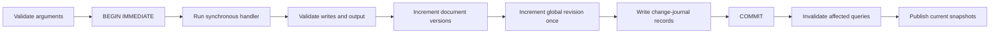

# Database revisions and correctness

Clank uses Node's built-in SQLite as a transactional document store. Application fields live as validated JSON, while identity, ownership, creation time, and document version live in dedicated columns.

There are two different revision concepts:

| Value | Scope | Meaning |
| --- | --- | --- |
| `runtime.version` / live `version` | Whole database | The latest committed change transaction observed by this runtime |
| `document._version` | One document | The number of content versions committed for that document |

If a page shows `revision 36`, it means the database has committed 36 change-producing transactions since its revision counter began. It does not mean there are 36 records, 36 users, or 36 browser connections. The number is an internal synchronization cursor, not an authentication state or a user-facing progress metric.

New interfaces should normally display `synced` or `reconnecting` and keep the numeric revision in diagnostics.

## Physical layout

For a declared `todos` table, Clank creates `clank_todos`:

```sql
CREATE TABLE clank_todos (
  _id TEXT PRIMARY KEY,
  _owner_id TEXT,
  _creation_time INTEGER NOT NULL,
  _version INTEGER NOT NULL,
  _data TEXT NOT NULL CHECK (json_valid(_data))
);
```

`_data` is canonical JSON derived from the table schema. Owned tables store `_owner_id` outside JSON so an application patch cannot change ownership.

Framework state uses:

- `clank_meta`: the persisted global revision;
- `clank_changes`: the bounded cross-process change journal;
- `clank_document_revisions`: bounded immutable application-document snapshots;
- `clank_auth_users` and `clank_auth_sessions`: built-in auth;
- `clank_migrations`: immutable SQL migration history.

The `clank_` and legacy `proact_` SQL namespaces are reserved. Safe application migrations cannot modify them.

## Commit sequence

Every mutation uses one synchronous `BEGIN IMMEDIATE` transaction:


```mermaid
flowchart LR
  A["Validate arguments"] --> B["BEGIN IMMEDIATE"]
  B --> C["Run synchronous handler"]
  C --> D["Validate writes and output"]
  D --> E["Increment document versions"]
  E --> F["Increment global revision once"]
  F --> G["Write change-journal records"]
  G --> H["COMMIT"]
  H --> I["Invalidate affected queries"]
  I --> J["Publish current snapshots"]
```

The application writes, global revision, and change records commit together. Any handler error, schema failure, stale-version conflict, invalid output, non-JSON output, or oversized output rolls back all of them.

Observers run after `COMMIT`. An observer exception is reported through `onError` and cannot turn a successful commit into a failed mutation response.

A transaction that changes several documents advances the global revision once. A transaction that makes no logical change does not advance it.

## Document versions and lost-update protection

Inserted documents start at `_version: 1`. A content-changing patch or replacement increments that document only. Deleting a document removes it. A no-op patch or replacement returns the existing immutable document without changing either revision.

Pass the version the user actually saw:

```ts
const saved = db.table("todos").patch(
  todo._id,
  { title: nextTitle },
  { ifVersion: todo._version },
);
```

If another browser changed or deleted the document first, Clank throws `DatabaseConflictError`. RPC converts it to HTTP `409 VERSION_CONFLICT` with the expected and actual versions. The stale mutation commits nothing.

This is optimistic concurrency control. It avoids holding a lock while a person edits and prevents last-write-wins data loss.

## Document history and compensating restore

Every create, content-changing update, delete, and restore records an immutable snapshot in the
same SQLite transaction as the application write and global revision. Rolled-back mutations leave
no snapshot. Multiple writes in one transaction share the global revision and receive stable
sequence numbers.

Read a single document or a whole visible collection newest-first:

```ts
const recent = db.table("todos").history(todoId, { limit: 25 });
const nextPage = db.table("todos").history({
  limit: 25,
  before: recent.at(-1)?.cursor,
});
```

`history()` uses the same ownership scope as `get()` and `collect()`. Alice cannot discover Bob's
revision IDs, deleted records, values, or counts. The result contains the operation, commit cursor,
timestamp, validated document snapshot, and (for a restore) its source cursor. Delete entries keep
the last removed snapshot so an authorized action can recover it.

A restore never rewinds SQLite, the live revision, or the audit trail. It validates the retained
snapshot against the current table schema and writes it as a new document version:

```ts
const restored = db.table("todos").restore(
  revision.document._id,
  revision.cursor,
  { ifVersion: current?._version ?? null },
);
```

Pass a number when the editor saw a current document and `null` when it saw a deletion. A race
returns `409 VERSION_CONFLICT`; a missing, expired, or other-owner cursor returns
`404 REVISION_NOT_FOUND` through browser RPC and MCP. Restoring the exact current value is a no-op.

History defaults to 10,000 committed database revisions globally and 100 snapshots per document.
Set `historyRetentionRevisions` and `historyRetentionPerDocument` in `openSQLite`/`openBackend` to
smaller positive limits when values are large. Reads return at most 100 entries per call. Sanitized
preview branching always purges the revision table because old snapshots may contain values that
are no longer present in the current production row.

Singleton records, such as one profile per user, should accept `version: number | null`. `null` means “I observed no record”; the mutation checks and inserts inside one transaction, so simultaneous creates cannot silently overwrite one another.

## Consistent reads

Queries run inside a short deferred SQLite read transaction. The global revision is read in the same snapshot as the application rows, so a query cannot combine rows from different commits.

Returned documents, cached query outputs, and change metadata are immutable at runtime. One subscriber cannot accidentally alter the snapshot delivered to another subscriber.

Before a cached one-shot query is used, the runtime synchronizes its persisted revision cursor. Correctness therefore does not depend on waiting for the background poll.

## Dependency and ownership invalidation

Clank records what each query reads:

- `get(id)` depends on one table/document pair;
- `query()` and `collect()` depend on the table;
- owned-table dependencies also include the authenticated owner.

Each committed journal record contains a table, document ID, and optional owner ID. Only intersecting cache entries become dirty. Bob's private todo mutation does not rerun or republish Alice's todo query.

The numeric global revision still advances for every committed transaction. It is an operational cursor, not a per-user counter, which is another reason not to present it as product data.

## Multiple server processes

File-backed runtimes poll `clank_changes` every 100 ms by default. Local commits publish immediately. If several commits accumulated, a runtime combines their affected records and publishes one snapshot at the newest revision because SQLite can only read the current database state.

The journal retains 10,000 revisions by default. If a process was offline long enough to miss retained history, Clank performs a conservative full cache invalidation. Authenticated live streams are closed and reconnect with freshly resolved authorization.

Browser `EventSource` reconnects receive a complete current snapshot. The client ignores payloads older than the snapshot it already holds.

This supports several processes sharing one SQLite file on one host. It is not a distributed multi-host database protocol. Network filesystems and independently replicated SQLite files are outside the supported consistency model.

## Auth revisions

Auth user and session writes use the same transaction/revision journal. Role changes, disabling a user, password changes, logout, and session revocation invalidate the affected identity.

Across processes, affected live streams close as soon as the other runtime observes the journal record. Long-lived server callers refresh their session record before each operation, so a role downgrade is not left cached.

## Durability and file safety

File databases default to:

- WAL journal mode;
- `synchronous = FULL`;
- foreign keys enabled;
- extension loading disabled;
- `trusted_schema = OFF`;
- recursive triggers disabled;
- secure deletion enabled;
- a five-second busy timeout;
- startup `quick_check` and foreign-key validation.

Database, WAL, SHM, backup, and restored files are restricted to mode `0600` where the operating system supports POSIX modes. Final database paths cannot be symbolic links. Corrupt databases and semantically inconsistent revision journals stop startup instead of being used.

Set `durability: "normal"` only after accepting weaker power-loss durability. Set `integrityCheck: "full"` for SQLite's more expensive full startup check, or `false` only when another verified operational process owns integrity checking.

## Migrations, backup, and restore

Ordered SQL migrations are checksummed and immutable. All pending files and ledger rows run inside one `BEGIN IMMEDIATE`. Safe mode rejects database attachment, extension loading, PRAGMAs, transaction control, and every `clank_` or `proact_` table reference.

Backup and restore:

1. reject symbolic-link and non-file sources;
2. verify SQLite integrity and foreign keys;
3. write a private temporary file;
4. verify the completed copy;
5. atomically replace the destination;
6. remove stale WAL/SHM sidecars.

Code-only deployments keep the current application online while a candidate starts and passes its
health check, then switch ingress before draining the prior process. The deployment platform stops
the application before a pending migration or restore. A failed migration, startup, or health
check on that exclusive path restores the verified pre-release snapshot.

## Important options

```ts
const runtime = await openBackend(backend, {
  path: "./data/app.sqlite",
  durability: "full",
  integrityCheck: "quick",
  busyTimeout: 5_000,
  changePollIntervalMs: 100,
  changeRetentionRevisions: 10_000,
  maxRequestBytes: 64 * 1024,
  maxResponseBytes: 4 * 1024 * 1024,
  maxLivePayloadBytes: 4 * 1024 * 1024,
  onError(error) {
    logger.error(error);
  },
});
```

All numeric resource limits must be positive integers. Slow SSE consumers are disconnected instead of being allowed to build an unbounded queue; EventSource reconnect then restores the current snapshot.

## Guarantees and boundaries

Clank guarantees atomic local commits, consistent SQLite snapshots, optimistic conflict detection when `ifVersion` is used, owner-scoped invalidation, and persisted same-host process synchronization.

Application code must still:

- pass `_version` for user edits that could race;
- keep network calls and other asynchronous side effects outside mutations;
- authorize non-owned/public data explicitly;
- keep database files outside public static roots;
- run scheduled off-host backups;
- use an external database when requiring multi-host writes or continuous zero-downtime schema changes.

## Resuming live queries with smaller updates

Enable `liveResume: {}` on `openBackend()` and `liveResume: true` on `createSyncClient()` or
`createClient()` to negotiate `splice-v1` SSE updates. Unmodified clients and servers keep the
existing full-snapshot behavior. The client retains its last event ID; on reconnect, the server
uses a matching retained snapshot to send only the changed JSON span when that is smaller than
the full result. Ordinary connected updates benefit from the same mechanism.

Replay entries are scoped to the exact session and parsed query arguments. Authentication changes
or a change-journal reset clear retained snapshots. Missing, expired, evicted, cross-query, or
cross-session IDs yield a complete current snapshot. State is process-local: reconnecting to
another replica or a restarted process also falls back safely. No database history or credential
is sent in the event ID. Event IDs become opaque for negotiated clients; the payload still carries
the numeric committed revision.

The default replay cache retains at most 100 snapshots, eight MiB of serialized data plus scope
accounting, and 60 seconds of history. Configure `maxEntries`, `maxBytes`, and `maxAgeMs` inside
`liveResume` to adjust those limits. This is a serialized-data budget, not an exact heap-size
measurement. A result too large for retention is still sent as a normal full snapshot.

The client validates the base ID, splice bounds, JSON result, and reconstructed payload size
(default one MiB; configurable with `maxLiveBytes`). If a delta cannot be applied, it closes that
stream and reconnects once in snapshot-only mode. Old revisions remain ignored. Reordering most
of a result may make a full snapshot smaller; the server compares encoded sizes before choosing.
No public query semantics or authorization rules change.

## Recycle bin for owned records

`@clank.run/framework/recycle-bin` exposes deleted records from Clank's existing revision store.
Restoring a record retains its original ID, creation time, and owner and creates a new version.
Only explicitly selected `.owned()` tables are available through the service.

```ts
import { openRecycleBin, createRecycleBinClient, mountRecycleBin } from "@clank.run/framework/recycle-bin";
const trash = await openRecycleBin({ path, schema, auth,
  tables: { notes: { labelField: "title" } }, retentionMs: 30 * 86400000,
  validateRestore(document, { table, db }) { enforceCurrentBusinessRules(table, document, db); },
});
// Route /__clank/trash/* to trash.handle(request).
const client = createRecycleBinClient({ auth: authClient });
await client.trash("notes", note._id, note._version);
const dispose = mountRecycleBin(panel, client, "notes");
```

Deletion rejects stale record versions. Lists return only the latest still-deleted snapshots for
the current account, with cursor pagination and expiry timestamps. Restore requires that exact
deleted cursor and refuses to overwrite a live or newer record. Schema and ownership are always
enforced. Use the synchronous `validateRestore` hook for cross-record business rules; it executes
inside the restore transaction and can reject recovery without changing data. Generic restoration
does not automatically rerun an application's normal mutation handlers.

The panel supports refresh, older pages, restore, and permanent deletion with an explicit history
removal acknowledgement. Permanent deletion calls `WriteTable.purgeDeleted(id, cursor)` and removes
all retained versions only while the current record is still deleted at the observed cursor. It
also invalidates live history queries. Other accounts cannot inspect or purge those versions.

Call `trash.purgeExpired(100)` from an existing maintenance loop to remove expired deleted history;
each sweep is bounded and rechecks that a record has not been restored. Close the service at shutdown.
The default window is 30 days, configurable from one second to 90 days. Recovery is available only
while the native revision is retained: global `historyRetentionRevisions` and per-document history
limits may expire snapshots sooner. Configure retention consistently on every connection that
writes the same database. Expiry and permanent purge do not erase independent backup archives.

## Record history and comparison panel

`@clank.run/framework/record-history` adds account-owned history browsing and restore controls to
the native revision journal. Enable only the tables whose complete historical content the owner
may inspect; the service does not redact fields from past versions.

```ts
import { openRecordHistory, createRecordHistoryClient, mountRecordHistory } from "@clank.run/framework/record-history";
const history = await openRecordHistory({ path, schema, auth, tables: ["notes"],
  validateRestore(document, { table, db }) { enforceCurrentBusinessRules(table, document, db); },
});
// Route /__clank/history/* to history.handle(request).
const client = createRecordHistoryClient({ auth: authClient });
const dispose = mountRecordHistory(panel, client, "notes", note._id);
```

The panel shows timestamps, operations, and document versions, loads older snapshots in pages of
25, compares a selected version with the current content, and explicitly restores the selection.
Restore creates a new revision instead of rewriting history and requires the current version the
caller observed (or null for a deleted record). A concurrent edit causes a conflict. The optional
synchronous validator runs inside that same transaction for business rules that schema validation
alone cannot express; normal mutation handlers are not automatically replayed.

`compareRecordVersions(before, after, maximum)` returns added, removed, or changed fields with JSON
Pointer paths, before/after values, and an explicit truncation flag. It distinguishes missing fields
from null, compares objects independent of key order, treats arrays as whole values, and collapses
objects below depth 16. Each input is bounded to 64 KiB and the default change limit is 100 (maximum
1,000). The panel renders comparison data as text and excludes framework metadata fields from the
content diff. Its inline comparison size limit does not prevent restoring a larger retained record.

History availability follows the existing global and per-document revision retention settings.
Missing or expired snapshots cannot be restored; another account receives no history. Close the
service and dispose the panel when the host route is removed.
